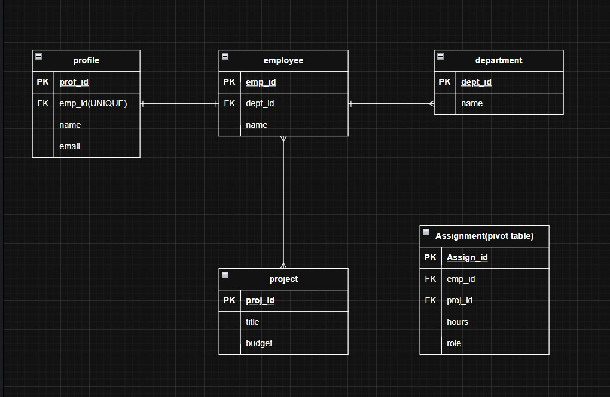
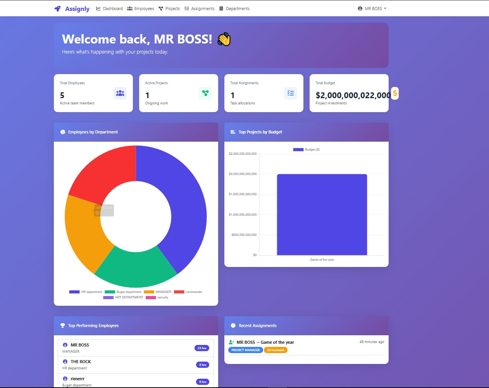
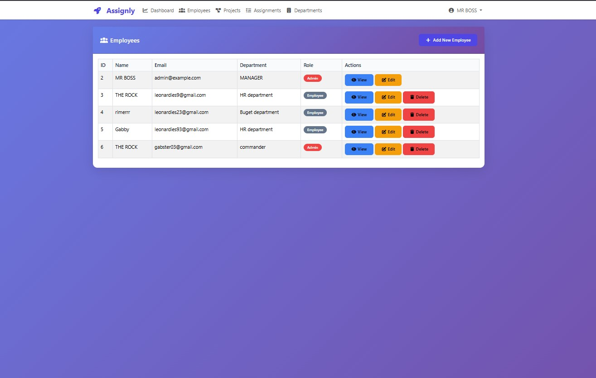
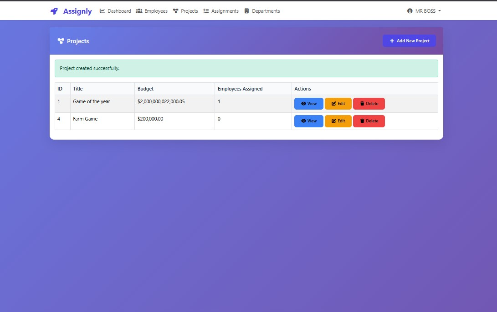
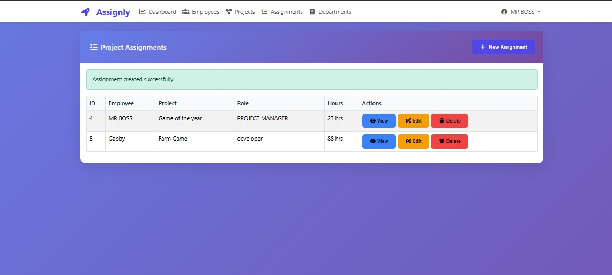

# Staff Tracker System


> **⚠️ Requirements:** PHP 8.4 or higher is required. PHP 8.3 is NOT supported.

## ✨ Features

### Dashboard Analytics
- **Interactive Charts** - Doughnut chart for department distribution, bar chart for project budgets, line chart for hours tracking
- **Statistics Cards** - Real-time counts for employees, projects, assignments, and total budget
- **Top Performers** - Leaderboard showing employees with most hours
- **Recent Activity** - Timeline of latest assignments

### Full CRUD Operations
- **Employee Management** - Create, read, update, delete employees with role-based access
- **Project Management** - Track project titles and budgets
- **Department Management** - Organize employees by department
- **Assignment Management** - Assign employees to projects with roles and hours

### Role-Based Access Control
- **Admin Users** - Full access to all features (manage employees, projects, departments, assignments)
- **Regular Users** - View only their own profile and assignments
- **Dynamic UI** - Buttons and menus automatically hide/show based on user role

### Security Features
- Authentication middleware protection
- Password hashing with Bcrypt
- CSRF protection
- SQL injection prevention via Eloquent
- Delete protection with foreign key constraints

## Database Relationships

| Relationship | Type | Tables |
|--------------|------|--------|
| One-to-Many | Department → Employee | One department has many employees |
| Many-to-Many | Employee ↔ Project | Many employees work on many projects (via Assignment pivot) |
| One-to-Many | Employee → Assignment | One employee has many assignments |
| One-to-Many | Project → Assignment | One project has many assignments |

## Pivot Table (Assignment)
| Column | Type | Description |
|--------|------|-------------|
| assign_id | PK | Primary key |
| emp_id | FK | References employees |
| proj_id | FK | References projects |
| hours | Integer | Hours per week |
| role | String | Role in project (Developer, Manager, etc.) |

## ER Diagram



## Tables

| Table | Primary Key | Foreign Keys |
|-------|-------------|--------------|
| departments | dept_id | - |
| employees | emp_id | dept_id |
| projects | proj_id | - |
| assignments | assign_id | emp_id, proj_id |

## Tech Stack

- **Backend:** Laravel 13
- **Frontend:** Bootstrap 5 + Blade Templates
- **Database:** SQLite
- **Charts:** Chart.js
- **Icons:** Font Awesome 6

## Screenshots

### Dashboard with Analytics
*Interactive charts showing department distribution, project budgets, and hours tracking*


### Employees Management
*Full CRUD operations with role-based access control*

### Projects Management
*Track project budgets and assigned employees*

### Assignments Management
*Assign employees to projects with roles and hours*

## Installation

```bash
# Clone repository
git clone https://github.com/rimerGAB/WAD_STAFF-TRACKER_ACT2.git
cd WAD_STAFF-TRACKER_ACT2

# Install PHP dependencies
composer install

# Install NPM dependencies
npm install

# Setup environment
cp .env.example .env
php artisan key:generate

# Create SQLite database (Windows)
type nul > database\database.sqlite

# Or using PowerShell
New-Item -Path database\database.sqlite -ItemType File

# Run migrations and seeders
php artisan migrate --seed

# Build assets
npm run build

# Start server
php artisan serve
```

## Default Login Credentials

| Role | Email | Password |
|------|-------|----------|
| Admin | admin@example.com | password |
| Employee | john@example.com | password |
| Employee | jane@example.com | password |

## Access Rules

| Feature | Admin | Regular Employee |
|---------|-------|------------------|
| View all employees | ✓ | ✗ (own only) |
| Edit employees | ✓ | ✓ (own only) |
| Delete employees | ✓ | ✗ |
| Manage departments | ✓ | ✗ |
| Manage projects | ✓ | ✗ |
| Create assignments | ✓ | ✗ |
| Edit assignments | ✓ | ✗ |
| Delete assignments | ✓ | ✗ |
| View assignments | ✓ | ✓ (own only) |
| Change department | ✓ | ✗ |
| Change password | ✓ | ✓ |

--------------------------------------------------------------------
Features Implemented
Full CRUD operations for all entities

Eloquent relationships with eager loading

Interactive dashboard with Chart.js graphs

Role-based authentication and authorization

Admin middleware for protected routes

Dynamic UI (buttons hide/show based on role)

Responsive Bootstrap 5 design

Foreign key constraint protection on delete

SQLite database support
-----------------------------------------------------------------
License
MIT

Author
rimerGAB
------------------------------------------------
Built with Laravel 13
        
